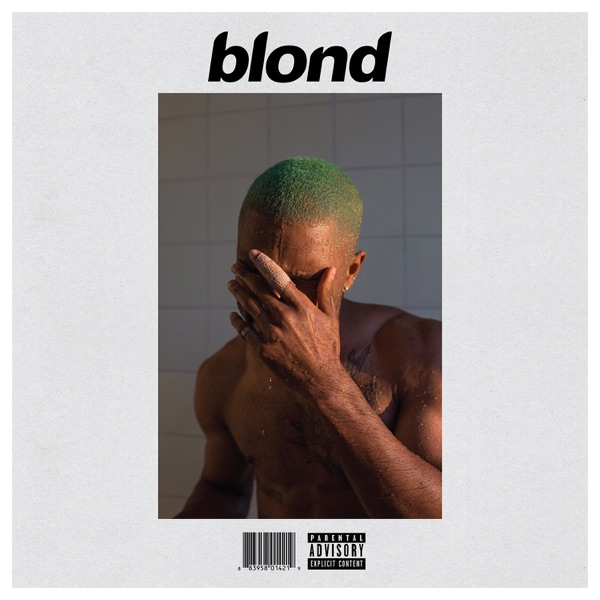
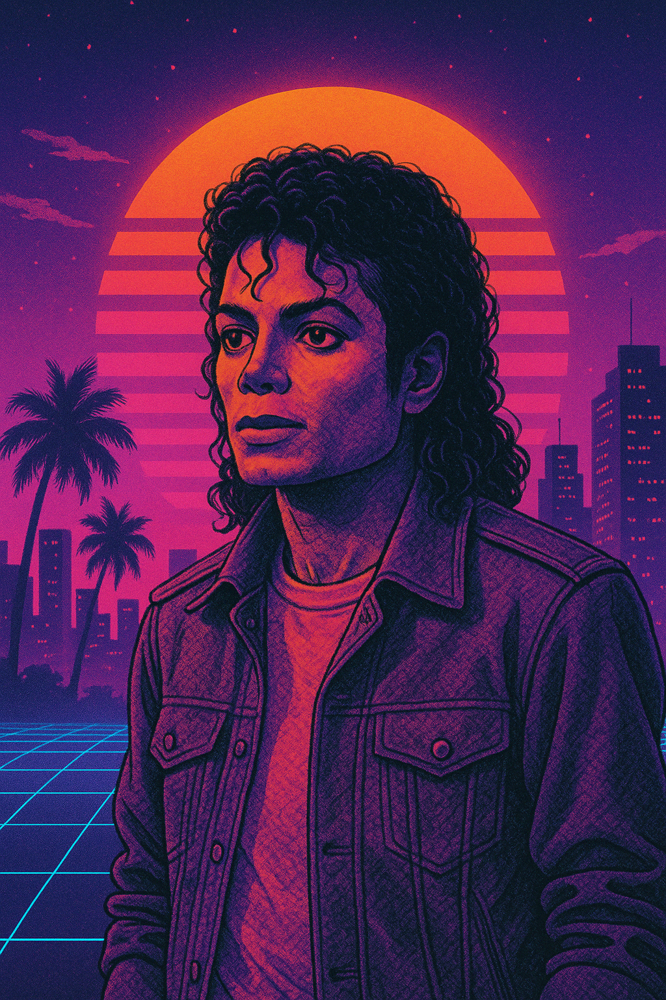

# Lovable Prompt — Midnight Vinyl Retrowave Redesign

Copy everything below this line into Lovable.

---

## PROJECT BRIEF

Redesign **Midnight Vinyl** — a portfolio music player web app — with a bold **retrowave / synthwave / vaporwave** aesthetic. The app streams **30-second iTunes/Apple Music preview URLs** (NOT full Spotify playback). Keep all existing JavaScript logic working; **only redesign HTML structure (if needed) and completely rewrite CSS** for a stunning retro-futuristic look.

**Live reference:** https://midnight-vinyl-playe.web.app  
**Repo:** CapChris20/Midnight-Vinyl-Music-Player-Project

---

## DESIGN DIRECTION (RETROWAVE)

I want the original cyberpunk vibe back — but **executed properly**:

- **Colors:** Hot magenta `#ff6bcf`, electric cyan `#2de2e6`, deep purple `#b014d9`, sunset orange `#ff8500`, neon pink `#f6019d`
- **Fonts:** Orbitron or Audiowide for headings; keep readable body font
- **Effects:** Neon text-shadow glow, scanlines overlay, grid horizon (CSS), chromatic aberration on hover, CRT vignette, animated gradient shimmer on titles
- **Video backgrounds:** Full-screen looping MP4 behind a dark gradient overlay (`rgba(0,0,0,0.35–0.5)`) so text stays readable
- **Player:** Floating glass/neon panel over the video — NOT flat minimal Spotify style
- **Home page:** Three artist cards (Weeknd, Frank Ocean, MJ) with neon borders, glow on hover, vaporwave title "Midnight Vinyl"
- **Artist pages:** Each artist gets accent color — Weeknd (red/crimson), Frank Ocean (orange/warm), MJ (gold)

---

## CRITICAL: DO NOT BREAK THESE

### Required DOM IDs & classes (JavaScript depends on these)

**Video background (`#bg-media`):**
- `#bg-media`, `#bg-video`, `.bg-poster`, `.bg-loading-spinner`, `.bg-error-msg`
- Body class `artist-page` on player pages
- `data-artist="weeknd" | "frank-ocean" | "michael-jackson"` on body

**Player (`#player-main`):**
- `#player-main`, `.vinyl-panel` (or rename visually but keep hook points below)
- `#album-disc`, `#album-art`, `#eq-bars` (7 `<span>` children)
- `#song-title`, `#artist-name`, `#now-playing-meta`
- `#time-display`, `#progress-bar`, `#buffer-bar`, `#scrub-tooltip`
- Buttons: `.btn-play`, `.btn-pause`, `.btn-forward`, `.btn-backward`, `.btn-shuffle`, `.btn-repeat`, `.btn-vol-up`, `.btn-vol-down`, `.btn-mute`
- `#volume-display`
- Toggle classes: `.is-spinning` on `#album-disc`, `.is-active` on `#eq-bars` and buttons, `.is-pulsed` on buttons, `data-mode="off|all|one"` on repeat btn

**Scripts load order on artist pages:**
1. `video-background.js`
2. `audio-player.js`
3. `player-core.js`
4. `weeknd.js` / `frankocean.js` / `mj.js`

### Performance rules (keep these)
- Video: `preload="none"`, muted, loop, playsinline — loaded via `initVideoBackground()` NOT inline src
- Videos path: `videos/compressed/*.mp4` and `.webm` (already compressed to 720p, 1–3MB)
- **Mobile ≤768px:** Hide `#bg-video`, use `.bg-poster` + animated CSS gradient fallback
- Audio must load FIRST; video is decorative and deferred
- Album art comes from iTunes JSON `artworkUrl100` field — do NOT use external image hosts

### Asset paths (do not change)
| Page | Video MP4 | Video WebM | Poster |
|------|-----------|------------|--------|
| Home | `videos/compressed/homebackground.mp4` | `homebackground.webm` | `music-home.JPG` |
| Weeknd | `videos/compressed/weekndbg.mp4` | `weekndbg.webm` | `weekndphoto.PNG` |
| Frank Ocean | `videos/compressed/frankoceanbg.mp4` | `frankoceanbg.webm` | `frankphoto.PNG` |
| MJ | `videos/compressed/mjbg.mp4` | `mjbg.webm` | `mjphoto.PNG` |

| Card images (home) | `weekndphoto.PNG`, `frankphoto.PNG`, `mjphoto.PNG` |
| Song data JSON | `weeknd_merged.json`, `frank_ocean.json`, `michael_jackson.json` |

---

## PAGES TO REDESIGN

1. **`index.html`** + **`style.css`** — Home/landing
2. **`weeknd.html`**, **`frankocean.html`**, **`mj.html`** + **`player.css`** — Shared player layout (3 pages identical structure, different artist config)

You may add decorative HTML (scanlines div, grid horizon, chrome corners) as long as required IDs/classes remain.

---

## EXISTING CODE (preserve logic, restyle visuals)

### index.html
```html
<!DOCTYPE html>
<html lang="en">
<head>
  <meta charset="UTF-8" />
  <meta name="viewport" content="width=device-width, initial-scale=1.0" />
  <title>Midnight Vinyl</title>
  <link rel="stylesheet" href="style.css" />
</head>
<body>
  <a class="skip-link" href="#main-content">Skip to content</a>
  <div id="bg-media" class="bg-media" aria-hidden="true">
    <video id="bg-video" preload="none" muted loop playsinline></video>
    <div class="bg-poster"></div>
  </div>
  <main id="main-content">
    <header class="hero">
      <span class="hero-badge">Portfolio · Music Player</span>
      <h1 class="vapor-heading">Midnight Vinyl</h1>
      <p class="vapor-sub">Stream 30-second previews from The Weeknd, Frank Ocean, and Michael Jackson — with cinematic backgrounds and a premium player experience.</p>
    </header>
    <div class="artist-grid">
      <a href="weeknd.html" class="artist-card artist-card--weeknd">
        <div class="artist-card__img-wrap">
          
        </div>
        <div class="artist-card__body">
          <div class="artist-card__name">The Weeknd</div>
          <span class="artist-card__cta">Enter player →</span>
        </div>
      </a>
      <a href="frankocean.html" class="artist-card artist-card--frank">
        <div class="artist-card__img-wrap">
          
        </div>
        <div class="artist-card__body">
          <div class="artist-card__name">Frank Ocean</div>
          <span class="artist-card__cta">Enter player →</span>
        </div>
      </a>
      <a href="mj.html" class="artist-card artist-card--mj">
        <div class="artist-card__img-wrap">
          
        </div>
        <div class="artist-card__body">
          <div class="artist-card__name">Michael Jackson</div>
          <span class="artist-card__cta">Enter player →</span>
        </div>
      </a>
    </div>
  </main>
  <script src="video-background.js"></script>
  <script>
    initVideoBackground({
      mp4: 'videos/compressed/homebackground.mp4',
      webm: 'videos/compressed/homebackground.webm',
      poster: 'music-home.JPG',
      deferMs: 1500,
    });
  </script>
</body>
</html>
```

### frankocean.html (weeknd.html & mj.html are same structure, different title/data-artist/artist name/script)
```html
<!DOCTYPE html>
<html lang="en">
<head>
  <meta charset="UTF-8" />
  <meta name="viewport" content="width=device-width, initial-scale=1.0" />
  <title>Frank Ocean — Midnight Vinyl</title>
  <link rel="preconnect" href="https://audio-ssl.itunes.apple.com" />
  <link rel="stylesheet" href="https://cdnjs.cloudflare.com/ajax/libs/font-awesome/6.5.1/css/all.min.css" />
  <link rel="stylesheet" href="player.css" />
</head>
<body class="artist-page" data-artist="frank-ocean">
  <a class="skip-link" href="#player-main">Skip to player</a>
  <a class="backtohome" href="index.html">← Home</a>
  <div id="bg-media" class="bg-media" aria-hidden="true">
    <video id="bg-video" preload="none" muted loop playsinline></video>
    <div class="bg-poster"></div>
    <div class="bg-loading-spinner" aria-hidden="true"></div>
    <p class="bg-error-msg" role="alert" hidden>Video unavailable</p>
  </div>
  <main id="player-main" class="player-wrapper" aria-label="Frank Ocean music player">
    <div class="vinyl-panel">
      <div class="album-stage">
        <div id="album-disc" class="album-disc">
          
        </div>
        <div id="eq-bars" class="eq-bars" aria-hidden="true">
          <span></span><span></span><span></span><span></span><span></span><span></span><span></span>
        </div>
      </div>
      <div class="song-info">
        <h1 id="song-title" class="song-title">Loading…</h1>
        <p id="artist-name" class="artist-name">Frank Ocean</p>
        <p id="now-playing-meta" class="now-playing-meta" aria-live="polite"></p>
      </div>
      <div class="progress-container">
        <span id="time-display" class="time-display">0:00 / 0:30</span>
        <div class="progress-track-wrapper">
          <div id="buffer-bar" class="buffer-bar"></div>
          <input type="range" id="progress-bar" value="0" min="0" step="0.1" aria-label="Seek" />
          <span id="scrub-tooltip" class="scrub-tooltip" hidden>0:00</span>
        </div>
      </div>
      <div class="player-controls" role="group" aria-label="Playback controls">
        <div class="controls-row controls-primary">
          <button type="button" class="control-btn btn-backward" aria-label="Previous"><i class="fa-solid fa-backward"></i></button>
          <button type="button" class="control-btn btn-play" aria-label="Play"><i class="fa-solid fa-play"></i></button>
          <button type="button" class="control-btn btn-pause" hidden aria-label="Pause"><i class="fa-solid fa-pause"></i></button>
          <button type="button" class="control-btn btn-forward" aria-label="Next"><i class="fa-solid fa-forward"></i></button>
        </div>
        <div class="controls-row controls-secondary">
          <button type="button" class="control-btn btn-shuffle" aria-label="Shuffle" aria-pressed="false"><i class="fa-solid fa-shuffle"></i></button>
          <button type="button" class="control-btn btn-repeat" data-mode="off" aria-label="Repeat" aria-pressed="false"><i class="fa-solid fa-repeat"></i></button>
          <button type="button" class="control-btn btn-vol-down" aria-label="Volume down"><i class="fa-solid fa-volume-low"></i></button>
          <button type="button" class="control-btn btn-mute" aria-label="Mute"><i class="fa-solid fa-volume-high"></i></button>
          <span id="volume-display" class="volume-display">70%</span>
          <button type="button" class="control-btn btn-vol-up" aria-label="Volume up"><i class="fa-solid fa-volume-high"></i></button>
        </div>
      </div>
    </div>
  </main>
  <script src="video-background.js"></script>
  <script src="audio-player.js"></script>
  <script src="player-core.js"></script>
  <script src="frankocean.js"></script>
</body>
</html>
```

### Artist config JS (keep as-is, only paths matter)

**weeknd.js**
```javascript
document.addEventListener('DOMContentLoaded', () => {
  initVideoBackground({
    mp4: 'videos/compressed/weekndbg.mp4',
    webm: 'videos/compressed/weekndbg.webm',
    poster: 'weekndphoto.PNG',
  });
  new MidnightVinylPlayer({
    songsUrl: 'weeknd_merged.json',
    artistName: 'The Weeknd',
    filterSongs: (raw) => raw.filter((s) =>
      s.previewUrl && s.artistName?.toLowerCase() === 'the weeknd' && !/remix|cover/i.test(s.trackName)
    ),
  });
});
```

**frankocean.js**
```javascript
document.addEventListener('DOMContentLoaded', () => {
  initVideoBackground({
    mp4: 'videos/compressed/frankoceanbg.mp4',
    webm: 'videos/compressed/frankoceanbg.webm',
    poster: 'frankphoto.PNG',
  });
  const banned = ['remix', 'rework', 'edit', 'bootleg', 'cover', 'version'];
  new MidnightVinylPlayer({
    songsUrl: 'frank_ocean.json',
    artistName: 'Frank Ocean',
    filterSongs: (raw) => raw.filter((s) => {
      const track = s.trackName?.toLowerCase() || '';
      const artist = s.artistName?.toLowerCase() || '';
      return s.previewUrl && !banned.some((w) => track.includes(w))
        && (artist.includes('frank ocean') || track.includes('frank ocean'));
    }),
  });
});
```

**mj.js**
```javascript
document.addEventListener('DOMContentLoaded', () => {
  initVideoBackground({
    mp4: 'videos/compressed/mjbg.mp4',
    webm: 'videos/compressed/mjbg.webm',
    poster: 'mjphoto.PNG',
  });
  new MidnightVinylPlayer({
    songsUrl: 'michael_jackson.json',
    artistName: 'Michael Jackson',
    filterSongs: (raw) => raw.filter((s) =>
      s.previewUrl && s.artistName?.toLowerCase() === 'michael jackson' && !/remix|cover/i.test(s.trackName)
    ),
  });
});
```

### video-background.js — DO NOT REWRITE (performance-critical)
Handles lazy video load, mobile fallback, direct streaming. ~150 lines. Uses `initVideoBackground({ mp4, webm, poster, deferMs })`.

### audio-player.js — DO NOT REWRITE
Web Audio API wrapper, rAF progress loop. Exports `class AudioPlayer`.

### player-core.js — DO NOT REWRITE
Main player: shuffle, repeat (off/all/one), keyboard shortcuts (Space, arrows, S, R, M), progress scrubbing, iTunes album art. Exports `class MidnightVinylPlayer`.

---

## RETROWAVE CSS INSPIRATION (implement in style.css + player.css)

### Home page ideas
- Full-screen video with purple/cyan gradient overlay + optional scanline pseudo-element
- Title "Midnight Vinyl" with animated gradient text + heavy neon glow
- Artist cards: neon border (cyan/magenta), box-shadow pulse on hover, slight 3D tilt
- Optional CSS grid floor perspective at bottom (classic synthwave horizon)

### Player page ideas
- Neon-outlined player panel floating center-screen
- Album disc with vinyl grooves (CSS conic-gradient ring), spins when `.is-spinning`
- EQ bars glow in artist accent color when `.is-active`
- Progress bar: thick (8–10px), cyan→magenta gradient fill, glowing thumb
- Buttons: transparent with neon border, fill glow on hover/active
- Back button: vaporwave pill with gradient text

### Mobile
- No video (`#bg-video { display: none }`)
- Poster + animated gradient background
- 48px+ tap targets

---

## JSON SONG DATA SHAPE (for reference)
Each song in JSON has:
```json
{
  "trackName": "Blinding Lights",
  "artistName": "The Weeknd",
  "previewUrl": "https://audio-ssl.itunes.apple.com/...",
  "artworkUrl100": "https://is1-ssl.mzstatic.com/.../100x100bb.jpg"
}
```

---

## DELIVERABLES

1. Redesigned **`style.css`** — retrowave home page
2. Redesigned **`player.css`** — retrowave player (shared by 3 artist pages)
3. Updated HTML only if adding decorative elements (scanlines, grid, etc.) — **keep all IDs/classes**
4. Do NOT convert to React unless asked — stay vanilla HTML/CSS/JS
5. Do NOT remove video background system
6. Do NOT add npm dependencies

**Success criteria:** Looks unmistakably retrowave/vaporwave, videos play behind UI, music starts fast, mobile works without video, all player controls functional.

---
